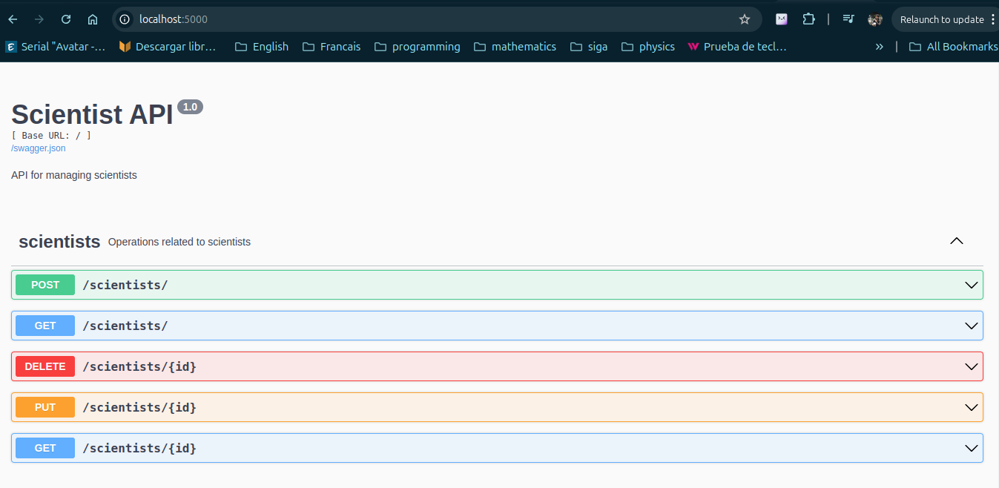

Run backend

Opción 1 (Sin scientists-database-services en dockerfile)
1.Iniciar docker (Esto crea e inicia la base de datos en postgres)
docker compose -f ./docker-compose.dev.yml up --build

2. Iniciar servicios de flask con POETRY
2.1 poetry shell (Accede al entorno virtual scientists-backend-py3.12)
2.2 poetry install  (Instala las dependencias de poetry, archivos pyproject.toml y poetry.lock)
2.3 python3 run.py 

